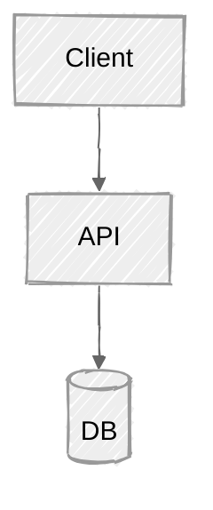

# Diagrams

Diagrams are authored as **Mermaid source** (`.mmd`), kept beside the article in
`<slug>/diagrams/`, and rendered to images for platforms that need them. Mermaid source
is diffable, regenerable, and can be grounded in real code.

## Choosing the diagram type

- **Architecture** (components/services and their relations) → `flowchart` or a C4-ish
  `flowchart` with subgraphs.
- **Flow / sequence of events** → `flowchart` (control flow) or `sequenceDiagram`
  (who-calls-whom over time).
- **State** → `stateDiagram-v2`.
- **Data model** → `erDiagram`.
- **The idea / mental model** → a minimal `flowchart`; fewer nodes, clearer labels.

Keep each diagram to one job. If it needs more than ~12 nodes, split it.

## Grounding in code

When a codebase was provided, draw from what's actually there: real module names, real
call edges, real data flow. Do not invent components. If you're unsure an edge exists,
read the code to confirm before drawing it — this is exactly what the diagram-accuracy
gate (SKILL.md step 3) checks.

## Hand-drawn look (optional, fits the "natural" feel)

Add a config header to the `.mmd` for a less-sterile aesthetic:



## Rendering

Render each `.mmd` to SVG (crisp, small) and/or PNG (universally accepted on upload):

```bash
npx -y @mermaid-js/mermaid-cli -i diagrams/architecture.mmd -o diagrams/architecture.svg
npx -y @mermaid-js/mermaid-cli -i diagrams/architecture.mmd -o diagrams/architecture.png -s 2
```

`-s 2` doubles resolution for retina/upload quality. If `mmdc` can't run in the
environment, leave the `.mmd` source and note in the report that images need rendering.

## Per-platform handling (the adapters use this)

| Platform | Diagram delivery |
|---|---|
| Medium | embed the PNG/SVG image; upload manually |
| LinkedIn | upload the PNG as an image (no inline images in text) |
| Dev.to | keep the Mermaid **source** in a ` ```mermaid ` block — it renders natively |
| X thread | attach the PNG to the relevant tweet |
| Blog MDX | reference the SVG, or embed the Mermaid block if the blog supports it |
